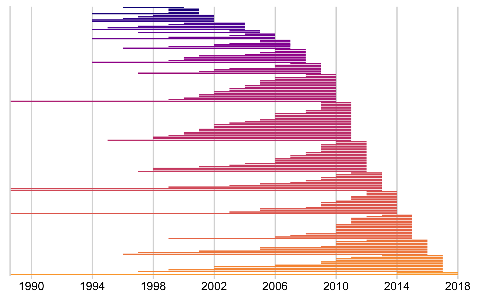

Results Vanished Journals
================

### For how long were the journals actively publishing?

We determined 193 fully open access journals that vanished from the web
between 2000 and 2018. Figure 1 presents the life-span of these ceased
journals. The majority of journals from our sample stopped actively
publishing during 2010 and 2018 (N = 138).

On average, journals were active for around 7 years. While we observed
journals with a long history of publication, the majority of journals
actively published five or less yearly issues (Median = 5). Among these
journals are the life-science journal “Annales Universitatis Mariae
Curie-Sklodowska - Sectio D. Medicina” that was actively publishing
between 1946 and 2010 and the “Durham Anthropological Journal”
(publication period: 1970 – 2013).

### What is the country and research discipline distribution of these journals?

Figure 2 presents a breakdown of the journal’s life-span by academic
discipline, highligthing that the life-span of journals did not
siginficantly vary across displines. Furthermore, it shows that
vanishing from the web was not limited to one field, but occured across
disciplines. Around 48.7 % of journals belonged to the Social Sciences
and Humanities domain (SSH), followed by Health Sciences (Health) (16.6
%), Physical Sciences and Mathematics (PSM) (14.5 %) and Life Sciences
(13.5 %) .

Overall, journals originate from 55 distinct countries. Figure 3
presents the geographic distribution of the vanished journals in terms
of World Bank regions, highlighting that the phenomena is global. Yet,
subject-specific differences can be observed. While in Northern American
and European regions mostly open access journals from the social
sciences and humanities vanished, in the region Southern Asia
life-science journals were well represented.

### What is the lag between last journal activity year and year of vanishing?

Using the Internet Archive’s Wayback Machine, we were able not just to
record the last journal activity year, but also the time when the
journal vanished, i.e. the last year this web archive was able to get
hold of a snapshot of the website. Figure summarizes the lag between the
last journal’s volume and disappearance from the web in years. Most
journals vanished one year after the last journal volume. The median
time span until vanishing was two years. Within four years after
publishing the last volume, around 75 % of the studied journals
vanished. An exception is, for instances, the Ghanian environmental
science journal “African Journal of Environmental Assessment and
Management”, which actively published between 1999-2008 and vanished in
2018.

