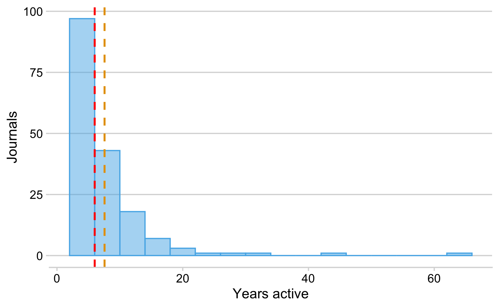

Results Vanished Journals
================

## Load data

Data was manually compiled and curated using a Google
spreadsheet.

<https://docs.google.com/spreadsheets/d/1M8WdNFpT8Xd-Bj7Eo_4Qcj-jBOdKQhRNxOHj1ckC0n0/edit#gid=0>

### How many journals disappeared?

    #> [1] 201

### When did they vanished from the Web?

### For how long were the journals actively publishing?

### Life-span of ceased journals

#### by Discipline

Summary table

| subject | n\_journals |     mean | median | q25 | q75 |
| :------ | ----------: | -------: | -----: | --: | --: |
| Health  |          29 | 7.931034 |      5 |   3 |  10 |
| LS      |          26 | 5.884615 |      5 |   4 |   7 |
| PSM     |          25 | 6.320000 |      6 |   4 |   8 |
| SSH     |          86 | 8.459770 |      7 |   4 |  10 |

Beeswarm
plot

Classic
boxplot

#### by country

Journals originate from 50 distinct countries.

| Country            |  n |      prop |
| :----------------- | -: | --------: |
| United States      | 34 | 20.118343 |
| India              | 16 |  9.467456 |
| Canada             | 10 |  5.917160 |
| Brazil             |  8 |  4.733728 |
| United Kingdom     |  8 |  4.733728 |
| Australia          |  7 |  4.142012 |
| Turkey             |  7 |  4.142012 |
| New Zealand        |  6 |  3.550296 |
| Spain              |  6 |  3.550296 |
| France             |  5 |  2.958580 |
| Venezuela          |  4 |  2.366864 |
| Germany            |  3 |  1.775148 |
| Indonesia          |  3 |  1.775148 |
| Philippines        |  3 |  1.775148 |
| Poland             |  3 |  1.775148 |
| Chile              |  2 |  1.183432 |
| Colombia           |  2 |  1.183432 |
| Finland            |  2 |  1.183432 |
| Iran               |  2 |  1.183432 |
| Italy              |  2 |  1.183432 |
| Japan              |  2 |  1.183432 |
| Netherlands        |  2 |  1.183432 |
| Pakistan           |  2 |  1.183432 |
| Portugal           |  2 |  1.183432 |
| Romania            |  2 |  1.183432 |
| USA                |  2 |  1.183432 |
| Argentina          |  1 |  0.591716 |
| Azerbaijan         |  1 |  0.591716 |
| Bulgaria           |  1 |  0.591716 |
| China              |  1 |  0.591716 |
| Costa Rica         |  1 |  0.591716 |
| Czech Republic     |  1 |  0.591716 |
| Egypt              |  1 |  0.591716 |
| Ghana              |  1 |  0.591716 |
| Hong Kong          |  1 |  0.591716 |
| Hungary            |  1 |  0.591716 |
| Ireland            |  1 |  0.591716 |
| Israel             |  1 |  0.591716 |
| Mexico             |  1 |  0.591716 |
| Nigeria            |  1 |  0.591716 |
| Peru               |  1 |  0.591716 |
| Puerto Rico        |  1 |  0.591716 |
| Russia             |  1 |  0.591716 |
| Russian Federation |  1 |  0.591716 |
| Slovakia           |  1 |  0.591716 |
| Switzerland        |  1 |  0.591716 |
| Thailand           |  1 |  0.591716 |
| UK                 |  1 |  0.591716 |
| Ukraine            |  1 |  0.591716 |
| Uruguay            |  1 |  0.591716 |

per Word Bank region

| region                    |  n |      prop |
| :------------------------ | -: | --------: |
| Northern America          | 46 | 27.218935 |
| Southern Asia             | 20 | 11.834319 |
| South America             | 19 | 11.242604 |
| Australia and New Zealand | 13 |  7.692308 |
| Eastern Europe            | 12 |  7.100592 |
| Northern Europe           | 12 |  7.100592 |
| Western Europe            | 11 |  6.508876 |
| Southern Europe           | 10 |  5.917160 |
| Western Asia              |  9 |  5.325444 |
| South-Eastern Asia        |  7 |  4.142012 |
| Eastern Asia              |  4 |  2.366864 |
| Central America           |  2 |  1.183432 |
| Western Africa            |  2 |  1.183432 |
| Caribbean                 |  1 |  0.591716 |
| Northern Africa           |  1 |  0.591716 |

Suggestion: make a world map similar
to

<https://github.com/subugoe/oa2020cadata/blob/master/analysis/paper.md#global-map-of-journal-publishing>

where circle size represents the number of journals, an pies represent
the
subject

#### by evidence source

| Source                                                                            |  n |      prop |
| :-------------------------------------------------------------------------------- | -: | --------: |
| Ulrichsweb OA Journal Comparison                                                  | 55 | 32.544379 |
| DOAJ Removed journals 2012-2014                                                   | 51 | 30.177515 |
| Morrison 2016                                                                     | 27 | 15.976331 |
| Discovered During Earlier Studies (Laakso et al 2011 and Björk, Shen Laakso 2016) | 17 | 10.059172 |
| Scopus OA Journal Comparison                                                      | 13 |  7.692308 |
| DOAJ 2019                                                                         |  5 |  2.958580 |
| DOAJ 2010-2012 Comparison                                                         |  1 |  0.591716 |

### Archives

The Keepers by subject

| subject | The Keepers (archived) | n\_journals |
| :------ | :--------------------- | ----------: |
| Health  | No                     |          28 |
| Health  | Yes                    |           1 |
| LS      | NA                     |           1 |
| LS      | No                     |          22 |
| LS      | Yes                    |           3 |
| PSM     | No                     |          24 |
| PSM     | Yes                    |           1 |
| SSH     | NA                     |           1 |
| SSH     | No                     |          82 |
| SSH     | Yes                    |           3 |
