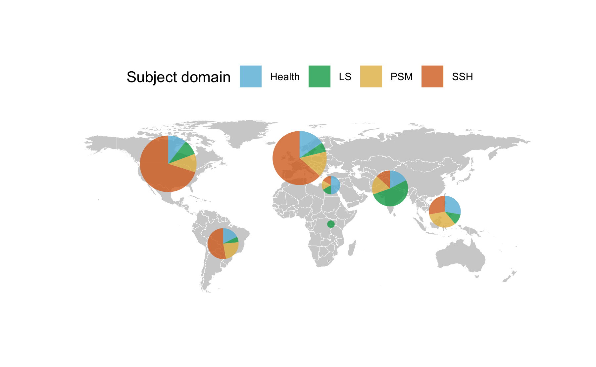
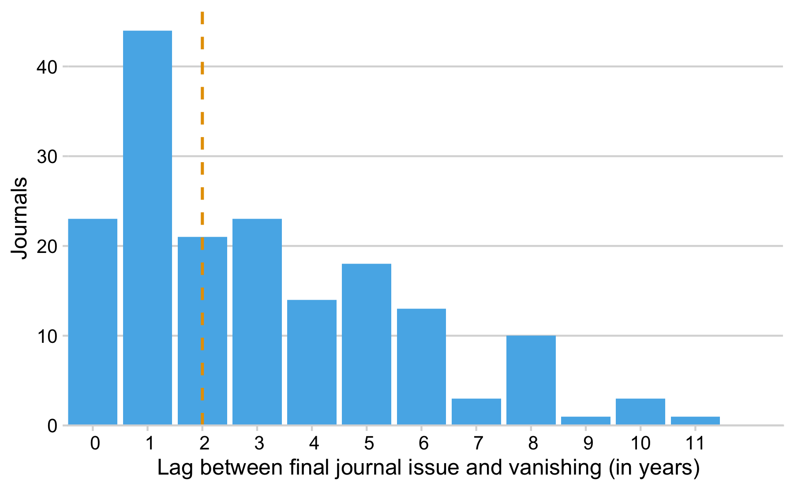

Results Vanished Journals
================

### For how long were the journals actively publishing?

We determined 193 fully open access journals that vanished from the web
between 2000 and 2018. Figure 1 presents the life-span of these ceased
journals. The majority of journals from our sample stopped actively
publishing during 2010 and 2018 (N = 145).

On average, journals were active for around 8 years. While we observed
journals with a long history of publication, the majority of journals
actively published five or less yearly issues (Median = 6). Among these
journals are the life-science journal “Annales Universitatis Mariae
Curie-Sklodowska - Sectio D. Medicina” that was actively publishing
between 1946 and 2010 and the “Durham Anthropological Journal”
(publication period: 1970 – 2013).

#### Table Figure 2

| Last publication year | Journals | Median Age | SD    |
| :-------------------- | :------- | :--------- | :---- |
| 2001                  | 4        | 3          | 2.5   |
| 2002                  | 5        | 7          | 1.79  |
| 2004                  | 5        | 8          | 2.55  |
| 2005                  | 3        | 3          | 3.79  |
| 2006                  | 4        | 6          | 4.55  |
| 2007                  | 7        | 5          | 3.82  |
| 2008                  | 10       | 6.5        | 4.1   |
| 2009                  | 9        | 4          | 6.96  |
| 2010                  | 27       | 6          | 12    |
| 2011                  | 33       | 6          | 4.57  |
| 2012                  | 23       | 5          | 4.37  |
| 2013                  | 13       | 7          | 13    |
| 2014                  | 14       | 4          | 3.2   |
| 2015                  | 14       | 6          | 3.4   |
| 2016                  | 9        | 12         | 5.87  |
| 2017                  | 10       | 10.5       | 5.47  |
| 2018                  | 2        | 18         | 18.38 |
| Total                 | 193      | 6          | 7.2   |

### What is the country and research discipline distribution of these journals?

Figure 2 presents a breakdown of the journal’s life-span by academic
discipline, highligthing that the life-span of journals slightly varies
across displines. Furthermore, it shows that vanishing from the web was
not limited to one field, but occured across disciplines. Around 51.8 %
of journals belonged to the Social Sciences and Humanities domain (SSH),
followed by Health Sciences (Health) (17.6 %), Physical Sciences and
Mathematics (PSM) (17.1 %) and Life Sciences (13.5 %) .

#### Table Figure 3

|            | Health | LS   | PSM  | SSH  | Total |
| ---------- | :----- | :--- | :--- | :--- | ----: |
| Journals   | 34     | 26   | 33   | 100  | 193.0 |
| Median Age | 5.0    | 6.0  | 5.0  | 6.5  |   6.0 |
| SD         | 10.95  | 3.98 | 5.02 | 6.90 |   7.2 |

Overall, journals originate from 50 distinct countries. Figure 3
presents the geographic distribution of the vanished journals in terms
of World Bank regions, highlighting that the phenomena is global. Yet,
subject-specific differences can be observed. While in Northern American
and European regions mostly open access journals from the social
sciences and humanities vanished, in the region Southern Asia
life-science journals were well represented.

### Table Figure 4

| region                     | Health | LS | PSM | SSH | Total | Proportion (in %) |
| :------------------------- | -----: | -: | --: | --: | ----: | ----------------: |
| East Asia & Pacific        |      7 |  2 |   6 |   7 |    22 |             11.40 |
| Europe & Central Asia      |     11 |  3 |  10 |  38 |    62 |             32.12 |
| Latin America & Caribbean  |      4 |  2 |   6 |  14 |    26 |             13.47 |
| Middle East & North Africa |      3 |  1 |   1 |   2 |     7 |              3.63 |
| North America              |      4 |  4 |   6 |  35 |    49 |             25.39 |
| South Asia                 |      4 | 13 |   4 |   4 |    25 |             12.95 |
| Sub-Saharan Africa         |      1 |  1 |   0 |   0 |     2 |              1.04 |
| Total                      |     34 | 26 |  33 | 100 |   193 |            100.00 |

Table presents the geographic distribution by income group. All vanished
journals in our sample originated from high or middle income countries.

| Income Group        | Vanished Journals | Proportion (in %) |
| :------------------ | ----------------: | ----------------: |
| High income         |               109 |             56.48 |
| Upper middle income |                47 |             24.35 |
| Lower middle income |                37 |             19.17 |
| Total               |               193 |            100.00 |

### What is the lag between last journal activity year and year of vanishing?

Using the Internet Archive’s Wayback Machine, we were able not just to
record the last journal activity year, but also the time when the
journal vanished, i.e. the last year this web archive was able to get
hold of a snapshot of the website. Figure summarizes the lag between the
last journal’s volume and disappearance from the web in years. Most
journals vanished one year after the last journal volume. The median
time span until vanishing was two years. Within four years after
publishing the last volume, around 75% of the studied journals vanished.
An exception is, for instances, the Ghanian environmental science
journal “African Journal of Environmental Assessment and Management”,
which actively published between 1999-2008 and vanished in 2018.

| Lag (in years) | Journals | Proportion (in%) | Cumulative Percentage |
| :------------- | -------: | ---------------: | --------------------: |
| 0              |       29 |               15 |                    15 |
| 1              |       53 |               27 |                    42 |
| 2              |       30 |               16 |                    58 |
| 3              |       27 |               14 |                    72 |
| 4              |       15 |                8 |                    80 |
| 5              |       13 |                7 |                    87 |
| 6              |        9 |                5 |                    91 |
| 7              |        4 |                2 |                    93 |
| 8              |        6 |                3 |                    96 |
| 9              |        1 |                1 |                    97 |
| 10             |        5 |                3 |                    99 |
| 11             |        1 |                1 |                   100 |
| Total          |      193 |              100 |                   931 |

### Language

| Journal Language(s)                  | Vanished Journals | Proportion (in %) | Mean Age (in years) |   SD |
| :----------------------------------- | ----------------: | ----------------: | ------------------: | ---: |
| English                              |               133 |             68.91 |                7.47 | 7.57 |
| Multiple languages including English |                30 |             15.54 |                7.60 | 5.51 |
| Non-English                          |                30 |             15.54 |                8.63 | 7.13 |

Table presents a breakdown of vanished journals by the journal’s
language relative to the publication activity in years. Most vanished
journals in our sample published English-language articles, while around
30 % of journals also dissemianted non-English-langauge research
articles. We found no notable difference between the language of the
journals and their age.
