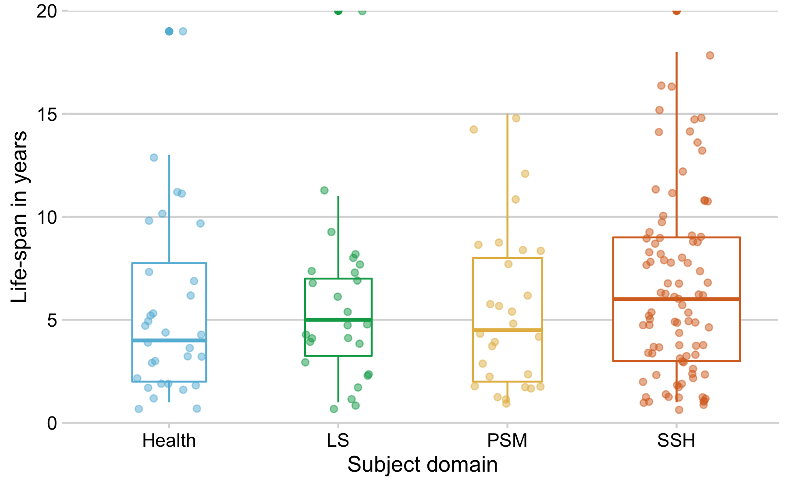
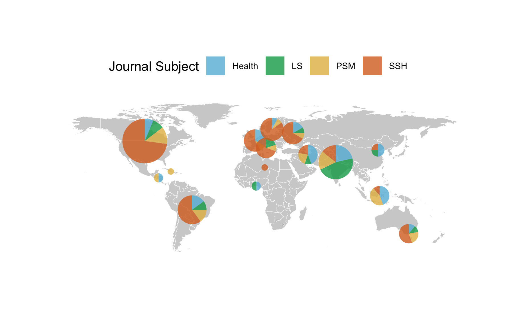

Results Vanished Journals
================

## Load data

Data was manually compiled and curated using a Google spreadsheet.

<https://docs.google.com/spreadsheets/d/1M8WdNFpT8Xd-Bj7Eo_4Qcj-jBOdKQhRNxOHj1ckC0n0/edit#gid=0>

### How many journals disappeared?

    #> [1] 208

### When did they vanished from the Web?

### For how long were the journals actively publishing?

### Life-span of ceased journals

#### by Discipline

Summary table

| subject | n\_journals |     mean | median | q25 |   q75 |
| :------ | ----------: | -------: | -----: | --: | ----: |
| Health  |          30 | 7.800000 |      5 | 3.0 |  9.25 |
| LS      |          26 | 5.884615 |      5 | 4.0 |  7.00 |
| PSM     |          27 | 6.148148 |      6 | 3.5 |  8.00 |
| SSH     |          87 | 8.420454 |      7 | 4.0 | 10.00 |

Classic boxplot

#### by country

Journals originate from 50 distinct countries.

| Country            |  n |       prop |
| :----------------- | -: | ---------: |
| United States      | 34 | 19.6531792 |
| India              | 16 |  9.2485549 |
| Canada             | 10 |  5.7803468 |
| Brazil             |  8 |  4.6242775 |
| United Kingdom     |  8 |  4.6242775 |
| Australia          |  7 |  4.0462428 |
| Turkey             |  7 |  4.0462428 |
| New Zealand        |  6 |  3.4682081 |
| Spain              |  6 |  3.4682081 |
| France             |  5 |  2.8901734 |
| Romania            |  4 |  2.3121387 |
| Venezuela          |  4 |  2.3121387 |
| Germany            |  3 |  1.7341040 |
| Indonesia          |  3 |  1.7341040 |
| Iran               |  3 |  1.7341040 |
| Netherlands        |  3 |  1.7341040 |
| Philippines        |  3 |  1.7341040 |
| Poland             |  3 |  1.7341040 |
| Chile              |  2 |  1.1560694 |
| Colombia           |  2 |  1.1560694 |
| Finland            |  2 |  1.1560694 |
| Italy              |  2 |  1.1560694 |
| Japan              |  2 |  1.1560694 |
| Pakistan           |  2 |  1.1560694 |
| Portugal           |  2 |  1.1560694 |
| USA                |  2 |  1.1560694 |
| Argentina          |  1 |  0.5780347 |
| Azerbaijan         |  1 |  0.5780347 |
| Bulgaria           |  1 |  0.5780347 |
| China              |  1 |  0.5780347 |
| Costa Rica         |  1 |  0.5780347 |
| Czech Republic     |  1 |  0.5780347 |
| Egypt              |  1 |  0.5780347 |
| Ghana              |  1 |  0.5780347 |
| Hong Kong          |  1 |  0.5780347 |
| Hungary            |  1 |  0.5780347 |
| Ireland            |  1 |  0.5780347 |
| Israel             |  1 |  0.5780347 |
| Mexico             |  1 |  0.5780347 |
| Nigeria            |  1 |  0.5780347 |
| Peru               |  1 |  0.5780347 |
| Puerto Rico        |  1 |  0.5780347 |
| Russia             |  1 |  0.5780347 |
| Russian Federation |  1 |  0.5780347 |
| Slovakia           |  1 |  0.5780347 |
| Switzerland        |  1 |  0.5780347 |
| Thailand           |  1 |  0.5780347 |
| UK                 |  1 |  0.5780347 |
| Ukraine            |  1 |  0.5780347 |
| Uruguay            |  1 |  0.5780347 |

per Word Bank region

| region                    |  n |       prop |
| :------------------------ | -: | ---------: |
| Northern America          | 46 | 26.5895954 |
| Southern Asia             | 21 | 12.1387283 |
| South America             | 19 | 10.9826590 |
| Eastern Europe            | 14 |  8.0924855 |
| Australia and New Zealand | 13 |  7.5144509 |
| Northern Europe           | 12 |  6.9364162 |
| Western Europe            | 12 |  6.9364162 |
| Southern Europe           | 10 |  5.7803468 |
| Western Asia              |  9 |  5.2023121 |
| South-Eastern Asia        |  7 |  4.0462428 |
| Eastern Asia              |  4 |  2.3121387 |
| Central America           |  2 |  1.1560694 |
| Western Africa            |  2 |  1.1560694 |
| Caribbean                 |  1 |  0.5780347 |
| Northern Africa           |  1 |  0.5780347 |

Suggestion: make a world map similar to

<https://github.com/subugoe/oa2020cadata/blob/master/analysis/paper.md#global-map-of-journal-publishing>

where circle size represents the number of journals, an pies represent
the subject

#### by evidence source

| Source                                                                            |  n |       prop |
| :-------------------------------------------------------------------------------- | -: | ---------: |
| Ulrichsweb OA Journal Comparison                                                  | 55 | 31.7919075 |
| DOAJ Removed journals 2012-2014                                                   | 51 | 29.4797688 |
| Morrison 2016                                                                     | 27 | 15.6069364 |
| Discovered During Earlier Studies (Laakso et al 2011 and Björk, Shen Laakso 2016) | 17 |  9.8265896 |
| Scopus OA Journal Comparison                                                      | 13 |  7.5144509 |
| DOAJ 2019                                                                         |  9 |  5.2023121 |
| DOAJ 2010-2012 Comparison                                                         |  1 |  0.5780347 |

### Archives

The Keepers by subject

| subject | The Keepers (archived) | n\_journals |
| :------ | :--------------------- | ----------: |
| Health  | No                     |          28 |
| Health  | Yes                    |           1 |
| Health  | NA                     |           1 |
| LS      | NA                     |           1 |
| LS      | No                     |          22 |
| LS      | Yes                    |           3 |
| PSM     | No                     |          24 |
| PSM     | Yes                    |           1 |
| PSM     | NA                     |           2 |
| SSH     | NA                     |           1 |
| SSH     | No                     |          82 |
| SSH     | Yes                    |           3 |
| SSH     | NA                     |           1 |
