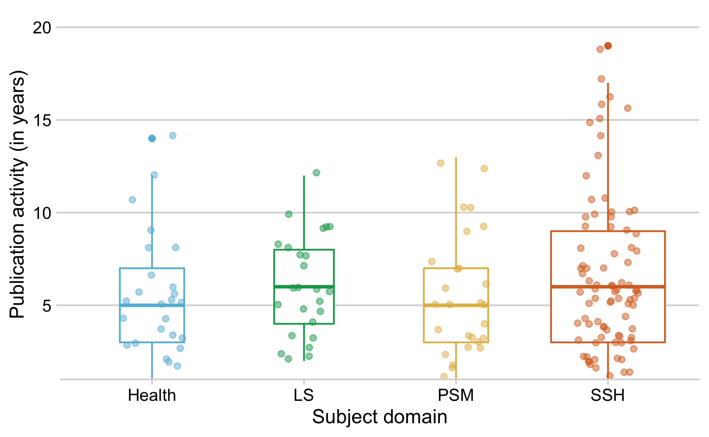

Results Vanished Journals
================

## Load data

Data was manually compiled and curated using a Google
spreadsheet.

<https://docs.google.com/spreadsheets/d/1M8WdNFpT8Xd-Bj7Eo_4Qcj-jBOdKQhRNxOHj1ckC0n0/edit#gid=0>

### How many journals disappeared?

    #> [1] 202

### When did they vanished from the Web?

### For how long were the journals actively publishing?

#### by Discipline

Summary table

| subject | n\_journals |     mean | median |  q25 | q75 |
| :------ | ----------: | -------: | -----: | ---: | --: |
| Health  |          31 | 8.580645 |    5.0 | 3.00 |  10 |
| LS      |          27 | 5.740741 |    5.0 | 3.50 |   7 |
| PSM     |          24 | 6.000000 |    5.5 | 3.75 |   8 |
| SSH     |          82 | 8.073171 |    6.5 | 4.00 |   9 |

Beeswarm
plot

#### by country

Journals originate from 49 distinct countries.

| Country            |  n |       prop |
| :----------------- | -: | ---------: |
| United States      | 31 | 18.5628743 |
| India              | 17 | 10.1796407 |
| Canada             | 10 |  5.9880240 |
| Brazil             |  8 |  4.7904192 |
| United Kingdom     |  8 |  4.7904192 |
| Australia          |  7 |  4.1916168 |
| Turkey             |  7 |  4.1916168 |
| New Zealand        |  6 |  3.5928144 |
| Spain              |  6 |  3.5928144 |
| France             |  5 |  2.9940120 |
| Venezuela          |  5 |  2.9940120 |
| Germany            |  3 |  1.7964072 |
| Indonesia          |  3 |  1.7964072 |
| Italy              |  3 |  1.7964072 |
| Philippines        |  3 |  1.7964072 |
| Poland             |  3 |  1.7964072 |
| Colombia           |  2 |  1.1976048 |
| Finland            |  2 |  1.1976048 |
| Iran               |  2 |  1.1976048 |
| Japan              |  2 |  1.1976048 |
| Netherlands        |  2 |  1.1976048 |
| Pakistan           |  2 |  1.1976048 |
| Portugal           |  2 |  1.1976048 |
| Romania            |  2 |  1.1976048 |
| USA                |  2 |  1.1976048 |
| Argentina          |  1 |  0.5988024 |
| Azerbaijan         |  1 |  0.5988024 |
| Bulgaria           |  1 |  0.5988024 |
| Chile              |  1 |  0.5988024 |
| China              |  1 |  0.5988024 |
| Costa Rica         |  1 |  0.5988024 |
| Czech Republic     |  1 |  0.5988024 |
| Egypt              |  1 |  0.5988024 |
| Ghana              |  1 |  0.5988024 |
| Hong Kong          |  1 |  0.5988024 |
| Hungary            |  1 |  0.5988024 |
| Ireland            |  1 |  0.5988024 |
| Israel             |  1 |  0.5988024 |
| Mexico             |  1 |  0.5988024 |
| Nigeria            |  1 |  0.5988024 |
| Peru               |  1 |  0.5988024 |
| Puerto Rico        |  1 |  0.5988024 |
| Russia             |  1 |  0.5988024 |
| Russian Federation |  1 |  0.5988024 |
| Switzerland        |  1 |  0.5988024 |
| Thailand           |  1 |  0.5988024 |
| UK                 |  1 |  0.5988024 |
| Ukraine            |  1 |  0.5988024 |
| Uruguay            |  1 |  0.5988024 |

per Word Bank region

| region                    |  n |       prop |
| :------------------------ | -: | ---------: |
| Northern America          | 43 | 25.7485030 |
| Southern Asia             | 21 | 12.5748503 |
| South America             | 19 | 11.3772455 |
| Australia and New Zealand | 13 |  7.7844311 |
| Northern Europe           | 12 |  7.1856287 |
| Eastern Europe            | 11 |  6.5868263 |
| Southern Europe           | 11 |  6.5868263 |
| Western Europe            | 11 |  6.5868263 |
| Western Asia              |  9 |  5.3892216 |
| South-Eastern Asia        |  7 |  4.1916168 |
| Eastern Asia              |  4 |  2.3952096 |
| Central America           |  2 |  1.1976048 |
| Western Africa            |  2 |  1.1976048 |
| Caribbean                 |  1 |  0.5988024 |
| Northern Africa           |  1 |  0.5988024 |

Suggestion: make a world map similar
to

<https://github.com/subugoe/oa2020cadata/blob/master/analysis/paper.md#global-map-of-journal-publishing>

where circle size represents the number of journals, an pies represent
the
subject

#### by evidence source

| Source                                                                            |  n |       prop |
| :-------------------------------------------------------------------------------- | -: | ---------: |
| Ulrichsweb OA Journal Comparison                                                  | 54 | 32.3353293 |
| DOAJ Removed journals 2012-2014                                                   | 53 | 31.7365269 |
| Morrison 2016                                                                     | 27 | 16.1676647 |
| Discovered During Earlier Studies (Laakso et al 2011 and Björk, Shen Laakso 2016) | 18 | 10.7784431 |
| Scopus OA Journal Comparison                                                      | 14 |  8.3832335 |
| DOAJ 2010-2012 Comparison                                                         |  1 |  0.5988024 |

### Archives

The Keepers by subject

| subject | The Keepers (archived) | n\_journals |
| :------ | :--------------------- | ----------: |
| Health  | No                     |          28 |
| Health  | Yes all                |           1 |
| Health  | Yes but couldn’t find  |           1 |
| Health  | Yes, couldn’t find     |           1 |
| LS      | No                     |          22 |
| LS      | Yes all                |           2 |
| LS      | Yes, couldn’t find     |           2 |
| LS      | Yes, partially         |           1 |
| PSM     | No                     |          22 |
| PSM     | Yes                    |           1 |
| PSM     | Yes all                |           1 |
| SSH     | No                     |          78 |
| SSH     | Yes                    |           1 |
| SSH     | Yes all                |           2 |
| SSH     | Yes, couldn’t find     |           1 |
